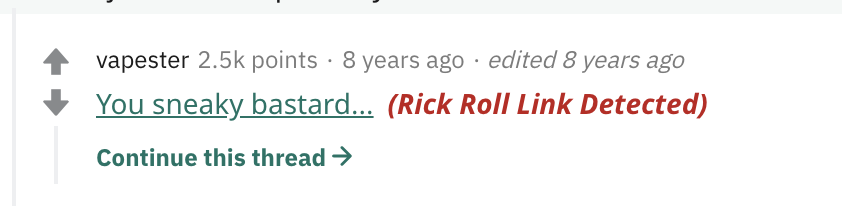

# Stale Meme Blocker

Isn't sad the people are still rickrolling people in 2020? Having this Chrome extension installed will help you not fall victim to stale memes.

## Steps to set up

1. Clone this repo
2. Visit `chrome://extensions`
3. Toggle on Developer Mode _(top right corner)_
4. Click **Load Unpacked** _(top left corner)_
5. Select the folder of the clone repo.

## Use

This extension will add an alert next to detected rick roll links _(seriously, its 2020, this wasn't funny 10 years ago)_

